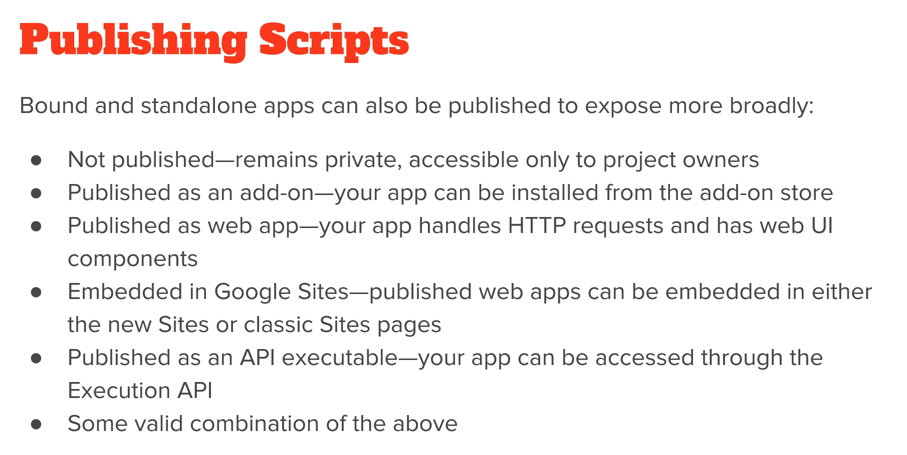

## GAS_Google_Apps_Script
#All about course Google Apps Script

## Introduction
* [  HolaMundo  ](./codes/HolaMundo.gs) 
* [  Segundo  ](./codes/Segundo.gs) 
* [  Tercero  ](./codes/Tercero.gs)
* [  Cuarto  ](./codes/Cuarto.gs)
* [  Menus1  ](./codes/Menus1.gs)
* [  Menus3  ](./codes/Menus3.gs)

## Ejemplo BuscarV
* [  Datos  ] (https://docs.google.com/spreadsheets/d/17A6VK9RJFGTO8bgHsMUwFLszzeooB2Ka3S6f0tWX3Ag/edit?usp=sharing)
* [ Buscar  ](./codes/Buscar.gs)

## Ejemplos
* [ Mover Renglones  ](./codes/MoverRenglones.gs)
* [ Ejemplo de Borrado  ](./codes/Borrado.gs)
* [ LeerDatosLibroExterno  ](./codes/LeerDatosExternos.gs )
* [ Ventanas PupUp  ](./codes/VentanasPopUp.gs )
* [ Datos Usuario  ](./codes/DatosUsuario.gs )
* [ Enviar Correos  ](./codes/EnviarCorreo.gs )

## Ejemplo para comparar la lectura de datos en linea vs vectores
* [  Datos  ] (https://docs.google.com/spreadsheets/d/1FsZk1Ps--kFb2PaxcBGzIPyMSsmw7iMYRikdPuxpMMA/edit?usp=sharing)
* [ Recorrer Vectores  ](./codes/RecorrerVectores.gs )

## Modificar un DOC con GAS y convertirlo en PDF
* [ Crear PDF ](./codes/CrearPDF.gs )
* [ Crear un Doc y modificarlo  ](./codes/CreateUpdate.gs )
* [ GAS to Docs & PDF  ](./codes/Gas_Doc_Pdf.gs )
* [ PDF MAsivos desde Sheets 1  ](./codes/Pdfs_Masivos1.gs )
* [ PDF MAsivos desde Sheets 2  ](./codes/Pdfs_Masivos2.gs )
* [ PDF MAsivos desde Sheets 3  ](./codes/Pdfs_Masivos3.gs )
* [ PDF MAsivos desde Sheets 4  ](./codes/Pdfs_Masivos4.gs )
* [ PDF MAsivos desde Sheets 5  ](./codes/Pdfs_Masivos5.gs )
* [ PDF MAsivos desde Sheets 6  ](./codes/Pdfs_Masivos6.gs )
* [ PDF MAsivos desde Sheets 7  ](./codes/Pdfs_Masivos7.gs )

## Introducción a Formularios
* Crear y gestionar un formulario a partir de una Sheet (crear 2 ejemplos al menos).
* Crear un formulario directamente desde las aplicaciones de Google y gestionarlo (crear 2 ejemplos al menos).
* [ Forms to PDF by Email  ](./codes/Forsm_PDF_Email.gs )
* [ Modificar un Form desde GAS ](./codes/modificarFormDesdeSheets.gs )

## Introducción a WebApp
* Crear y gestionar una WebApp.
* [ Mi primer WebApp ](./codes/miprimerWebapp.gs )
* [ Registro de Peso ](./codes/registroPeso.gs )
* [ Registro de Peso2 ](./codes/registroPeso2.gs )
* [ Otro ejemplo WebApp sin html ](./codes/Webapp2.gs )
* [ GAS to HTML ](./codes/gasToHtml.gs )
* [ Sheets To GAS to HTML ](./codes/ShhetsToGasToHtml.gs )
